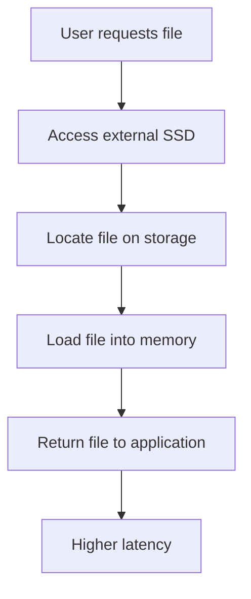

In this post, we’ll discuss **cache strategies in distributed systems** and how they help improve system performance and stability.

Caching refers to **temporarily storing frequently accessed data in a faster storage layer** so it can be retrieved more quickly. By avoiding repeated access to the primary data source, caching reduces both **latency** and **system load**.

A commonly used distributed caching system is **Redis**, which stores data in memory for extremely fast access.

## Understanding Caching: How It Reduces Latency

Imagine you have a file stored on an **external SSD**. Every time you want to open it, the system follows this path:




Now suppose we **store a copy of that file in RAM**. Since RAM is much faster than an SSD, the system can retrieve the file almost instantly. Instead of checking the SSD every time, it simply reads the data from RAM.

This is exactly how **caching reduces latency**.

### Reduced Load on the Database

Let’s look at a simple example using a database and a cache like **Redis**.

Suppose we want to fetch the details of a user with ID `42`.

A typical SQL query might be:

```sql
SELECT * FROM users WHERE id = 42 AND status = 'active';
```

Running this query repeatedly becomes expensive because the database must process and search the data every time.

Instead, we store the result in a cache as a **key-value pair**.

**Cache Key**

```text
user:42
```

**Cache Value**

```json
{ "name": "Alice", "status": "active" }
```

Now the application simply asks the cache:

> “Give me the value stored at `user:42`.”

Since the data is stored in memory, retrieving it is extremely fast—typically an **O(1)** operation.

This reduces both **response time** and **database load**, which is why caching is widely used in modern distributed systems.


#### 1. Cache Hit
A **cache hit** happens when the requested data **already exists in the cache**, so the system can return it immediately without querying the database.

#### 2. Cache Miss
A **cache miss** happens when the requested data **is NOT present in the cache**. The application fetches the data from the database, returns it to the user, and stores it in the cache for future requests.

### TTL (Time To Live)

Caches often use **TTL (Time To Live)**, which defines **how long a cached item remains valid**.

Once the TTL expires, the cache entry is removed.

For example:

```text
TTL = 10 minutes
```

After 10 minutes, the cached data expires and must be fetched again from the database.

While TTL helps keep data fresh, it can also introduce **serious system problems**.

### Synchronized TTL Expiry vs Jittered TTL


When cache keys have the **same TTL**, they expire **at the same time**, causing a sudden spike of cache misses and heavy database load (cache stampede).  
With **jittered TTL**, expiry times are slightly randomized, so keys expire **gradually over time**, spreading the load and keeping the system stable.

## The Problem: Many Keys Expiring at the Same Time

When many clients hit at once, the load balancer sends requests to the application server, which reads from the cache first. On a cache miss, the application queries the database. If many requests miss simultaneously, a **thundering herd** occurs.

A **thundering herd spike** causes performance to drop sharply and can eventually crash the system.

## Real-World Example: Cache Expiry

A common scenario occurs in **caching systems**, such as **Redis or in-memory caches**.

Consider an **e-commerce flash sale**.

A **Prime Sale starts at exactly 12 PM**, and thousands of users open the application at the same moment. But right before 12 PM, the **Redis cache expires**.

Because the cached data is no longer available, every incoming request tries to fetch the data directly from the **database**.
Instead of serving cached responses, the system suddenly receives **thousands of database queries simultaneously**, which can overload the backend. 

## Solutions to Prevent the Thundering Herd Problem

### 1. Stale-While-Revalidate (SWR) Strategy

In distributed systems, you often choose between **Consistency** (always the newest data) and **Availability** (always fast responses).  

The **Stale-While-Revalidate (SWR)** strategy favors **availability**.

If you watch **live match scores** on platforms like **Disney+ Hotstar**, the score may sometimes appear **a few seconds behind**, but the page loads instantly.

This happens because the system:

1. **Serves slightly stale cached data immediately**
2. **Fetches fresh data in the background**
3. **Updates the cache for future requests**

### Flow

```text
User Request -> Cache (expired) -> Return stale data immediately -> Background fetch -> Update cache
```

This approach keeps the system **fast and responsive**, even during large traffic spikes.

### 2. Cache Warming / Pre-Warming

**Cache warming** means populating the cache **before a traffic spike occurs**.

For example, before a sale starts, the system can preload frequently accessed data such as:

- Popular product pages
- Category listings
- User session data

When real users arrive, the data is **already present in the cache**, preventing a sudden surge of database queries.

### 3. Request Coalescing

Request coalescing prevents multiple identical requests from triggering the same expensive operation repeatedly. When many users request the same resource at the same time, the system groups those requests together and processes them using a **single backend call**.

The first request fetches the data from the database, while the remaining requests wait for the result instead of generating new database queries.


**Example:**  

```text
First request  -> fetches data from the database
Other requests -> wait for the same response
```

Instead of:  

**1000 requests → 1000 database queries**

The system performs:

**1000 requests → 1 database query**

This drastically reduces backend load and prevents unnecessary database pressure during traffic spikes.  

### 4. Cache Locking (Mutex)

Cache locking ensures that **only one process regenerates the cache when it expires**, while other requests temporarily wait.

Without cache locking, if the cache expires, thousands of requests may try to regenerate the same data simultaneously, causing a sudden surge of database queries.

With a locking mechanism in place, only the first request acquires the lock and regenerates the cache, while the others wait until the cache is updated.

**Example:**

```text
Request 1      -> acquires lock -> fetches data from DB
Other requests -> wait for cache refresh
```

Once the cache is updated, all waiting requests read the data directly from the cache instead of hitting the database.

### 5. Staggered / Probabilistic Cache Expiry

If many cached items expire at the same moment, the system may experience a **sudden burst of database requests**, which can lead to the Thundering Herd problem.

Staggered cache expiry helps prevent this by introducing a **small random delay to the cache expiration time**. This ensures that cache entries expire at slightly different times instead of all at once.

**Example:**

Instead of using a fixed expiration time:

```text
TTL = 600 seconds
```

You can add randomness:

```text
TTL = 600 + random(0-120)
```

This spreads cache expiration across time, reducing the chances of multiple cache misses happening simultaneously.  

## Conclusion

Caching is simple in concept, but designing it well in **distributed systems** requires careful planning. Traffic spikes, synchronized expirations, and large numbers of requests can quickly overwhelm backend systems if the cache is not managed properly.

By applying smarter cache strategies, systems can continue serving users **quickly and reliably**, even when demand suddenly increases. The goal is not just faster responses, but building systems that remain **stable under real-world traffic conditions**.