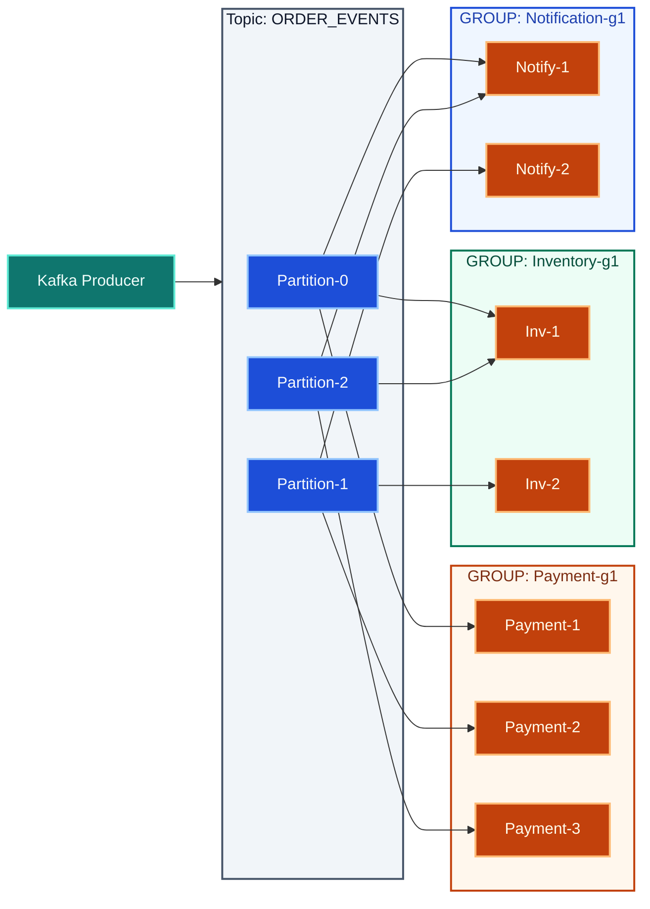

<div class="blog-post-kafka">

<p class="post-deck"><em>“Like you’re 5” here means <strong>make it obvious</strong>—plain language first. We’ll name <strong>topics</strong> <strong>partitions</strong>, and <strong>consumer groups</strong> as soon as the story in your head feels solid.</em></p>

<p class="post-lead">Imagine placing an order on any e-commerce platform. Now imagine hundreds of people doing this at the same time. Each order isn’t a single action, it’s a sequence of steps like applying coupons, checking inventory, processing payment, and sending confirmation. These steps generate events continuously, and if even one is missed, the system breaks.</p>

> **Example**  
> **One user places an order → payment succeeds but confirmation email fails → user thinks order didn’t go through → chaos. Multiply this by thousands, and your system collapses.**

This is the core problem: **too many things happening at once, continuously**.

---

## Kafka

Kafka solves this by acting as a system that manages a **continuous stream of events**. Instead of systems directly talking to each other (which creates tight coupling and failures), everything sends data into Kafka, and whoever needs it reads from there.

> **Example**  
> Order service doesn’t call payment service directly. It sends an “order placed” event to Kafka. Payment service reads it from Kafka and processes it. No direct dependency.

You can think of Kafka as a **central pipeline** where all data flows. It sits in the middle and handles the movement of information between systems in a reliable and scalable way.

<div class="post-flow-compare" role="group" aria-label="Direct coupling versus Kafka pipeline">
  <div class="post-flow-compare__col">
    <span class="post-flow-compare__label">Instead of</span>
    <p class="post-flow-compare__body"><strong>Order → Payment → Email → Inventory</strong></p>
  </div>
  <div class="post-flow-compare__col">
    <span class="post-flow-compare__label">With Kafka</span>
    <p class="post-flow-compare__body"><strong>Producer → Kafka → multiple Consumers</strong></p>
  </div>
</div>

Everything connects through Kafka, not to each other.

---

## Pub-Sub

Consider a construction site:

- The **Owner** defines the overall work.
- The **Contractor** manages and distributes tasks.
- The **Workers** perform tasks based on their specialization (e.g., plumbing, electrical, masonry).

The contractor does **not manually assign each task to a specific worker**. Instead, work is categorized, and workers take tasks based on their expertise.

### Mapping to Pub-Sub Architecture

| Construction site | In pub-sub | Role |
| --- | --- | --- |
| **Owner** | **Publisher** | Sends tasks (messages) without knowing who will execute them. |
| **Contractor** | **Message broker (event bus)** | Receives messages and routes them based on categories (topics). |
| **Workers** | **Subscribers** | Subscribe to specific types of work (topics) and receive only relevant tasks. |

A **Publish–Subscribe (Pub-Sub)** architecture is a messaging pattern where:

- **Publishers** send messages to a **broker** without knowing the subscribers.
- The **broker** organizes messages into **topics (or channels)**.
- **Subscribers** receive messages only from the topics they are subscribed to.

<figure class="post-figure">

<figcaption class="post-figure-caption text-center small text-muted mt-2">Diagram concept taken from <a href="https://ably.com/topic/pub-sub" rel="noopener noreferrer" target="_blank">Ably — What is Pub/Sub?</a></figcaption>
</figure>

Kafka works on a **publish–subscribe model**, where producers publish messages and consumers subscribe to what they need. Producers don’t know who the consumers are.

**Example**  
***An “order placed” event is published.***

1. Payment service consumes it  
2. Order service consumes it  
3. Analytics consumes it  

---

## Understanding Kafka Terminologies

### Message streams

Kafka deals with **continuous streams of events**, meaning data is always flowing. Instead of processing in batches, Kafka handles events in real time as they occur.

> **Example**  
> Every click, order, or payment generates an event that keeps moving through the system like a live stream.

### Topics

To organize this continuous flow, Kafka groups events into **topics**, which are simply categories of messages.

> **Example**  
> - `order_events` → all order-related data  
> - `payment_events` → all payment-related data  

Producers send data to topics, and consumers read only the topics they care about.

### Partitions

To handle large-scale data efficiently, each topic is divided into **partitions**.

Partitions allow Kafka to process data in parallel by splitting one stream into multiple ordered lanes. Each partition maintains its own order, but there is no global order across all partitions.

**Example**  
Instead of one sequence:

```text
Order1 → Order2 → Order3
```

You get parallel lanes. Order is **within each partition** only, not globally across partitions:

```text
Partition 0 → Order1, Order4
Partition 1 → Order2, Order5
Partition 2 → Order3, Order6
```

### Consumer groups

To process data, Kafka uses **consumer groups**, which are sets of consumer instances working together.

Kafka distributes partitions across consumers in a group so that each partition is handled by only one consumer at a time. This ensures efficient load sharing and avoids duplicate processing within the group.

> **Example** (topic has three partitions)
>
> - **3** consumers in the group → each gets **1** partition  
> - **2** consumers → one handles **2** partitions, the other **1**  
> - **5** consumers → only **3** do work; **2** stay idle  



---

## Combining Two Messaging Models

Kafka combines **publish–subscribe** and **queue-based processing** in one system.

| You configure | Kafka behaves like |
| --- | --- |
| Same topic + **same consumer group** | A **queue**: work is shared across consumers; each message is processed **once** within that group. |
| Same topic + **different consumer groups** | **Pub-sub**: each group sees the **full** stream independently. |

Across different consumer groups, Kafka behaves like **publish–subscribe**: multiple independent systems can read the same stream of data without affecting each other.

Within a consumer group, Kafka behaves like a **queue**: messages are distributed across consumers so that each message is processed only once within that group.

> **Example**
>
> - `payment-service (group.id=payment-g1)` - processes orders  
> - `analytics-service (group.id=analytics-g1)` - also reads orders  

Both receive the **same events independently** (pub-sub), but inside each group, the work is **split across instances** (queue).

This is why Kafka is fast and scalable.

It splits data into partitions, processes them in parallel, and allows multiple systems to consume the same data without conflict. You can scale by simply adding more partitions or more consumers.

**Example**

```text
Traffic increases → add more partitions → add more consumers → system keeps up without redesign.
```

Finally, Kafka ensures data is safe and ordered.

Messages are stored reliably and can be replicated across systems. Kafka guarantees that messages stay in order **within a partition**, which is critical for flows like payments and order processing.

> **Example**
>
> **Payment initiated → payment success → order confirmed**
>
> These must happen in order, and Kafka preserves that within a partition.

---

## Conclusion

By leveraging Kafka, a system can be built that:

- Manages continuous streams of events
- Acts as a central pipeline
- Splits work using partitions
- Distributes processing via consumer groups
- Allows multiple systems to use the same data independently

**And most importantly, it keeps everything from breaking when things scale.**

</div>
