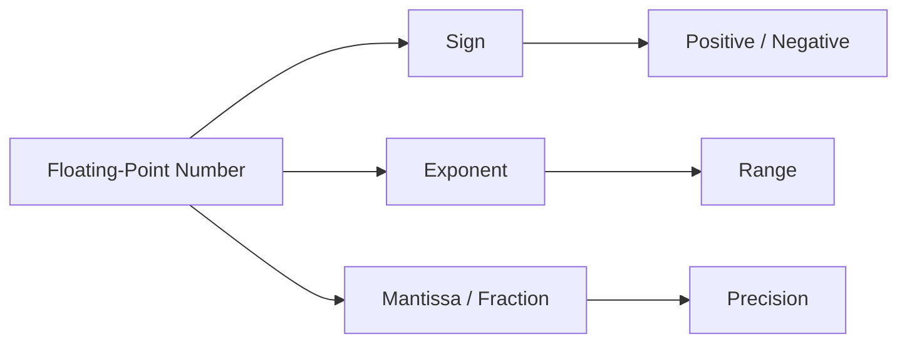
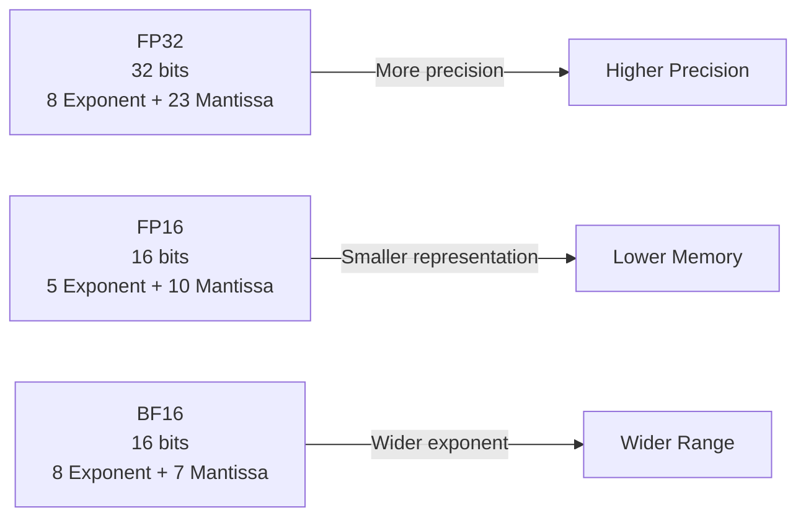

So today, we’ll first understand the numerical representation used in quantization, and how different numerical formats affect the way we represent model weights.

Before getting into quantization, let’s look at the different numerical formats used to represent model weights. Some common formats are FP32, FP16, FP8, BF16, and so on.

## Floating-Point Representation

A floating-point number has three main components:

- **Sign** — determines whether the number is positive or negative.
- **Exponent** — determines the range of values that can be represented.
- **Mantissa / Fraction** — determines the precision of the representation.

Under the hood, the value evaluates using this binary relationship:

$$\text{Value} = (-1)^{\text{sign}} \times (1 + \text{Mantissa}) \times 2^{\text{Exponent} - \text{Bias}}$$

For a normalized floating-point number, the sign determines whether the number is positive or negative, the exponent determines its range, and the mantissa determines its precision.

FP32, FP16, and BF16 all use these components, but they allocate a different number of bits to each one.

In general, more bits allocated to the exponent provide a wider range, while more bits allocated to the mantissa provide higher precision.

---

## Let's Take an Example: 2049

Now, let’s take the number 2049.

We can write it as:

$$2049 = 2048 + 1 = 2^{11} + 2^0$$

Its normalized binary representation is:

$$1.00000000001_2 \times 2^{11} = 2049$$

If we represent this number using FP32, we have 23 mantissa bits, so there is enough precision to represent the number exactly.

However, when we move from FP32 to FP16, we only have 10 mantissa bits. Therefore, FP16 cannot represent 2049 exactly.

The nearest representable FP16 values are 2048 and 2050. With round-to-nearest-even, 2049 is represented as:

$$2049 \rightarrow 2048$$

This is a simple example of precision loss when moving from a higher-precision format to a lower-precision format.

---

## So, What's the Advantage?

If we are losing some precision, why would we want to use lower-precision formats?

There are a few practical advantages.

### Lower VRAM Usage

FP32 uses 4 bytes per parameter, while FP16 and BF16 use 2 bytes per parameter.

For example, for a 7B-parameter model:

$$7 \times 10^9 \times 4\text{ bytes} \approx 28\text{ GB}$$

For FP16 or BF16:

$$7 \times 10^9 \times 2\text{ bytes} \approx 14\text{ GB}$$

This refers to the raw model weights. The actual VRAM requirement will be higher because of other components such as the KV cache, activations, runtime buffers, and framework overhead.

### Less Memory Bandwidth

Smaller numerical representations mean less data needs to be transferred between memory and the compute hardware.

This can improve throughput, especially for memory-bound workloads.

### Hardware Acceleration

Modern GPUs and AI accelerators are optimized for lower-precision computation.

Depending on the hardware, formats such as FP16, BF16, FP8, INT8, and INT4 can provide better computational efficiency.

### Neural Networks Can Tolerate Some Numerical Error

A small change in an individual weight does not necessarily cause a significant change in the model's output.

Neural networks can generally tolerate some numerical perturbation.

So, we are essentially making a trade-off:

- **Less precision** $\rightarrow$ **less memory usage and potentially better efficiency.**

---

## Comparing the Numerical Formats

The main difference between these formats is not just the total number of bits, but how those bits are allocated.

For example, FP16 and BF16 are both 16-bit formats, but they make different trade-offs between range and precision.

---

## Why Does the Numerical Format Matter?

When using a model, the numerical format in which we load it matters. Loading a model in an unsuitable format can affect how its weights are represented and, in some cases, can affect the model's quality.

So, choosing a numerical format is not simply about choosing the format with fewer bits. We also need to consider the range of values the model needs, the precision required, the available memory, and the hardware we are running it on.
