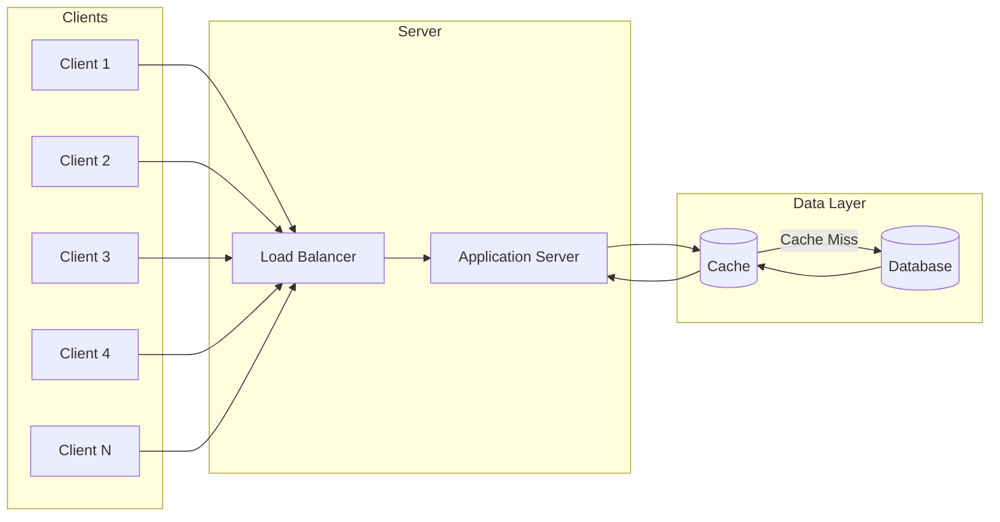
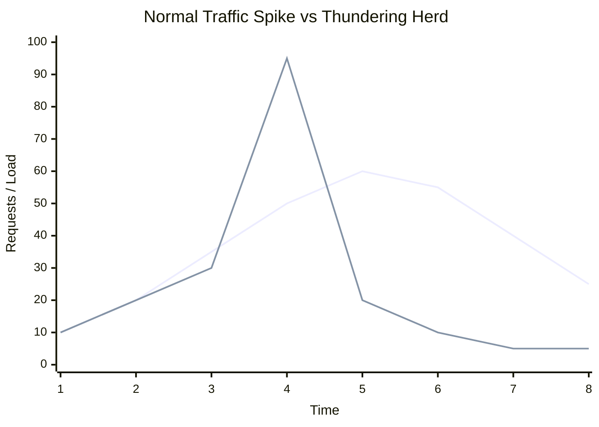

In this post we'll go through the **Thundering Herd Problem** in system design.

Suppose a company is launching a new product and has already created a lot of hype through marketing before the launch. On the **first day of the sale**, people will be eager to purchase it.
At their offline store, customers start arriving all at once. Everyone wants to buy the product as soon as possible, which causes a huge rush.

<!--  -->

This crowd rush has **both positive and negative impacts**.

**Positive:**  
It helps maintain the hype and can lead to strong product sales.

**Negative:**  
But what if the store is unable to control the crowd? What if customers cannot complete their purchases and get disappointed?
In that case, it can negatively affect sales. Customers may avoid purchasing the product, and it can also harm the brand's image.

Companies often use simple measures, such as queues and controlled entry, to manage the rush and keep operations smooth. The same idea applies in system design: we need strategies to handle many users hitting the system at once.

## Mapping This to System Design

In system design, the **crowd** is many clients sending requests at the same time, and the **store** is your servers, caches, or databases.

When request volume rises sharply in a short time window, we call it a **traffic spike**. It is not just "many users" it is a **sudden surge** that can overwhelm the system if it is not prepared.

Traffic spikes often happen during:

- **Peak usage hours** (e.g. lunch break, evening)
- **Flash sales or limited-time offers** on e-commerce sites
- **Major launches or events** (e.g. ticket sales, new feature releases)

Without the right controls, this sudden load can overload servers and caches and trigger the **thundering herd problem** which the rest of this post addresses.


## Why Traffic Spikes Overload Systems

Servers have limited resources such as:

- CPU
- Memory
- Database connections
- Network capacity

When requests arrive gradually, the system can process them smoothly.

However, when a large number of requests arrive at the same time, the system struggles to handle them. This leads to **increased latency and request congestion**.


## Why It Becomes Dangerous in Distributed Systems

In distributed systems, a **load balancer** is responsible for distributing incoming requests across multiple servers.

But if the number of incoming requests increases rapidly and there are not enough servers to handle them, the system becomes overloaded.

Requests keep increasing, but the infrastructure cannot process them fast enough, which may lead to **service slowdown or even system failure**.

A typical architecture where this happens looks like the following:


*When many clients hit at once, the load balancer sends requests to the application server, which reads from the cache first. On **cache miss**, the app hits the database and when many requests miss at the same time, the thundering herd occurs.*

The chart below shows how that spike in load looks over time.



- **Grey → Normal traffic spike** (stable/healthy system behavior)
- **Red → Thundering herd** (danger/overload)

The graph represents two scenarios:
- A **normal traffic spike**, where the system can handle the increase.
- A **Thundering Herd spike**, where a sudden surge causes performance to drop sharply, which may eventually crash the system.


## Auto-Scaling and Its Limitation

When a **Thundering Herd** occurs, one might think that **auto-scaling** configured in the _**scaling policy**_ can solve the problem.

And that is partially correct.
However, there is another challenge. In most systems, auto-scaling usually takes **around 2–7 minutes** to start new servers. During those **2–7 minutes**, the system still has to handle the sudden spike in traffic. So the question becomes: **what happens during that time window?**

To handle such situations effectively, systems need additional strategies.


## Where This Commonly Occurs

The Thundering Herd problem commonly appears in:
- Load balancers
- Caching systems
- Databases


## Real-World Example: Cache Expiry

A common scenario occurs in **caching systems**, such as **Redis or in-memory caches**.

Caching systems use a concept called **TTL (Time To Live)**, which defines how long cached data remains valid before it expires.

Now imagine this situation:

A **Prime Sale starts at exactly 12 PM**, and thousands of users open the application at the same moment. But right before 12 PM, the **Redis cache expires**.
Because the cached data is no longer available, every incoming request tries to fetch the data directly from the **database**.

Instead of serving cached responses, the system suddenly receives **thousands of database queries simultaneously**, which can overload the backend.


## Solutions to Prevent or Reduce the Problem

## 1. Auto-Scaling (with Pre-Warming)

Auto-scaling automatically adds more servers when the system detects increased traffic.

However, as mentioned earlier, starting new servers can take **2–7 minutes**. To reduce this delay, systems can use a technique called **pre-warming**.

Pre-warming means provisioning additional servers **before** the expected traffic spike. This can be done by adjusting the scaling policy, such as:

- Scaling when **CPU usage exceeds 80%**
- Scaling based on **scheduled time events** (for example, before a sale starts)

## 2. Traffic Simulation (Cron-Based Warmup)

For predictable events such as flash sales or product launches, systems can simulate traffic **before real users arrive**. This helps warm up caches, application servers, and load balancers so the system is ready to handle the spike.

Traffic simulation is often triggered using **scheduled cron jobs** that generate controlled requests to important endpoints in the system.

**Example:**

A cron job runs a few minutes before a sale starts:

```bash
*/5 11 * * * simulate-traffic.sh
```

This script sends sample requests to the system to:

- Warm up application instances
- Populate frequently accessed cache entries
- Establish database and network connections

By the time real users start hitting the system, the infrastructure is already active and ready to serve requests efficiently.

While above 2 solutions improves system readiness, it can also **increase infrastructure costs**, since extra resources need to run ahead of time.

## 3. Request Coalescing

Request coalescing prevents multiple identical requests from triggering the same expensive operation repeatedly. When many users request the same resource at the same time, the system groups those requests together and processes them using a **single backend call**.

The first request fetches the data from the database, while the remaining requests wait for the result instead of generating new database queries.

**Example:**

`First request → fetches data from the database`  
`Other requests → wait for the same response`

Instead of:

**1000 requests → 1000 database queries**

The system performs:

**1000 requests → 1 database query**

This drastically reduces backend load and prevents unnecessary database pressure during traffic spikes.


## 4. Cache Locking (Mutex)

Cache locking ensures that **only one process regenerates the cache when it expires**, while other requests temporarily wait.

Without cache locking, if the cache expires, thousands of requests may try to regenerate the same data simultaneously, causing a sudden surge of database queries.

With a locking mechanism in place, only the first request acquires the lock and regenerates the cache, while the others wait until the cache is updated.

**Example:**

`Request 1 → acquires lock → fetches data from DB`  
`Other requests → wait for cache refresh`

Once the cache is updated, all waiting requests read the data directly from the cache instead of hitting the database.


## 5. Staggered Cache Expiry

If many cached items expire at the same moment, the system may experience a **sudden burst of database requests**, which can lead to the Thundering Herd problem.

Staggered cache expiry helps prevent this by introducing a **small random delay to the cache expiration time**. This ensures that cache entries expire at slightly different times instead of all at once.

**Example:**

Instead of using a fixed expiration time:

**TTL = 600 seconds**

You can add randomness:

**TTL = 600 + random(0–120)**

This spreads cache expiration across time, reducing the chances of multiple cache misses happening simultaneously.


## 6. Exponential Backoff

When systems are under heavy load, retrying failed requests immediately can make the situation worse. If thousands of clients retry at the same moment, the server may become even more overloaded.

Exponential backoff solves this by increasing the wait time between retries, allowing the system time to recover before handling new requests.

**Example:**

Instead of retrying instantly:

`Retry pattern → **1s → 2s → 4s → 8s**`

Each retry waits longer than the previous one, which reduces pressure on overloaded servers and prevents retry storms.


## 7. Rate Limiting

Rate limiting controls how many requests a client can send to the system within a certain time window. This prevents any single user or service from overwhelming the system with excessive requests.

If the request limit is exceeded, the system can either **reject the request, delay it, or queue it for later processing**.

**Example:**

A system may allow:

**100 requests per second per user**

If a user sends more requests than allowed, the extra requests are either rejected or temporarily blocked.

This ensures fair resource usage and protects backend systems from sudden bursts of traffic.


## Conclusion

Traffic spikes are usually a good sign they mean people are actively using your system. The key is making sure the system is **robust enough to handle those peaks without breaking down**.

In practice, this often means combining multiple strategies: caching techniques, request control mechanisms, and smart scaling depending on the system's needs.

Ultimately, the real challenge in system design is simple: **ensuring the system continues to run smoothly even when everyone shows up at once.**
